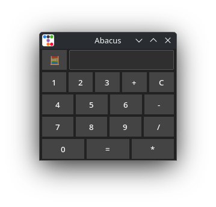

# Abacus

Simple Calculator on Tk 🪶!

## Features

- 🗔 Simple UI

- 🖥🖩 Basic calculations

## Installation

You can download Abacus from [releases](https://github.com/progwi0/abacus/releases) or via [Pix](https://github.com/progwi0/pix).
